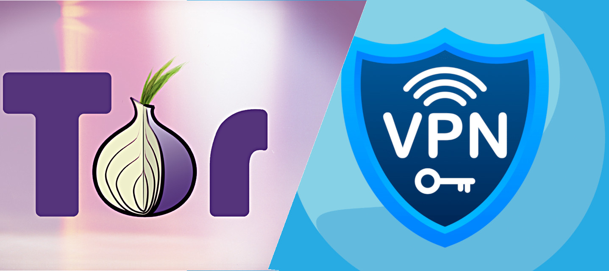
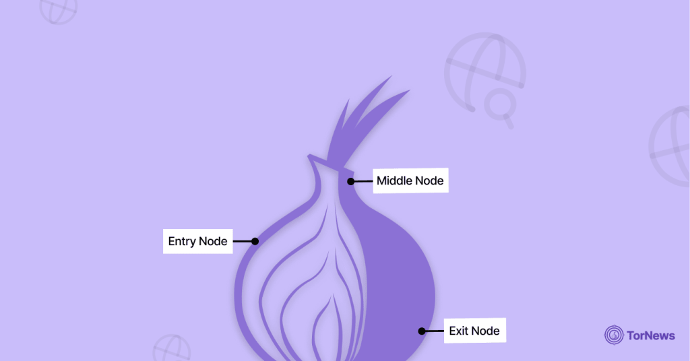
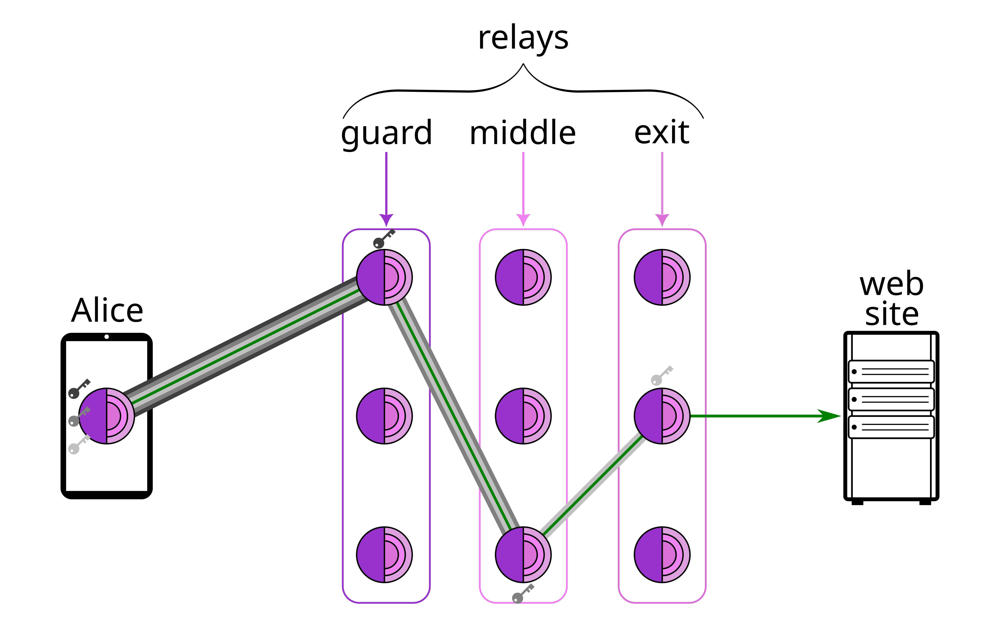
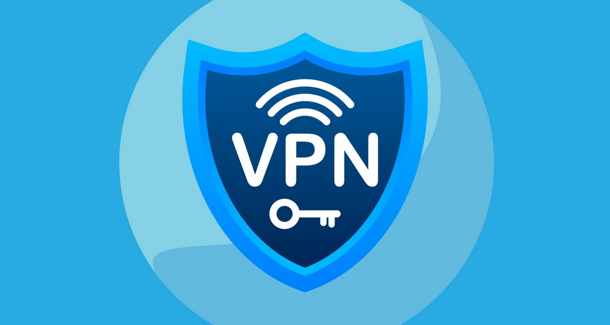
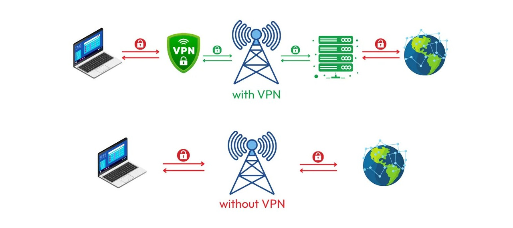
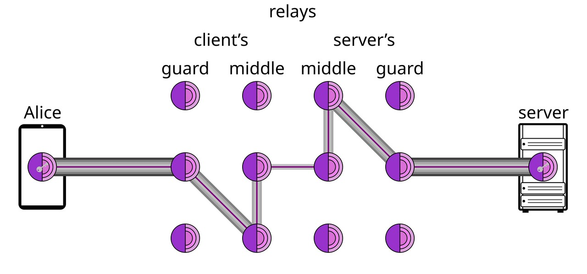

## Breve panoramica su casi d'uso di TOR e VPN

Sento spesso nominare a sproposito questi due sistemi di "*anonimizzazione*", pertanto ho pensato di scrivere due righe sui vari casi d'uso di questi due sistemi, modo da chiarire se e quando usarli, ma soprattutto se e quale utilizzare.

### **TOR**, the Onion routing.

**TOR non è TOR Browser** 
Questo è il primissimo errore che in molti fanno. 
TOR è un protocollo, TOR Browser è, appunto, un browser che utilizza il protocollo TOR.

Dopo questa prima e sostanziale premessa, vi faccio un piccolissimo accenno al protocollo Onion Routing per cercare, in seguito, di spiegarvi come e perché utilizzarlo.

Questa si sopra è un'immagine molto esplicativa, ma solo per chi già conosce questo protocollo. 
Iniziamo però a vedere le tre componenti del *routing*, ovvero: il nodo di **entrata**, il nodo **mediano** ed il nodo di **uscita**.

Il protocollo Onion Routing si basa proprio su questi tre layer di separazione. 
Vediamo però meglio come funzionano.

Ipotizziamo che Alice voglia collegarsi ad un sito internet utilizzando il protocollo Onion Routing. 
Il computer (o telefono) di Alice si collegherà ad un primo relay chiamato **guard** (guardia). Questo primo relay, conoscerà l'indirizzo IP di Alice e riceverà un pacchetto di dati crittografati di cui conoscerà una chiave. 
Una volta aperto questo pacchetto, troverà al suo interno un secondo pacchetto crittografato ed un indirizzo di un secondo nodo a cui invierà questo pacchetto di dati. Abbiamo tolto il primo strato.

Il pacchetto ora arriverà al secondo relay chiamato **middle** (mediano). Questo secondo relay, conoscerà solo l'indirizzo del precedente nodo, e quindi, non quello di Alice. 
Il middle relay, tramite una chiave, toglierà un secondo stato di crittografia del pacchetto di dati, trovando un ulteriore pacchetto di dati crittografato e l'indirizzo di un ulteriore nodo.

Il pacchetto dati di Alice è ora arrivato al relay chiamato **Exit** (uscita) che con un'ultima chiave, aprirà il pacchetto di dati. Questo relay conoscerà l'indirizzo dei server (sito) che Alice vuole visitare in quanto sarà lui stesso a doverlo contattare, ma non conoscerà il mittente.

Il pacchetto di dati è finalmente giunto a destinazione. 
Vediamo ora cosa è successo al nostro pacchetto di dati:
1. Primo relay: **Guard**
    * è a conoscenza dell'indirizzo IP di Alice, ma non conosce il sito a cui Alice vuole collegarsi;
2. Secondo relay: **Middle**
    * è il nodo che rimane più all'oscuro di tutti, non conosce nè l'indirizzo IP di Alice e nemmeno il sito che Alice vuole contattare;
3.  Terzo ed ultimo relay: **Exit**
    * il nodo di uscita, ha una informazione importante, conosce il sito a cui qualcuno vuole collegarsi, ma non sa che quel qualcuno è Alice.

Ecco il funzionamento dell'Onion Routing. 
Il pacchetto di dati parte con un triplo strato che viene via via scoperto ogni passaggio che viene fatto nella rete TOR.

Ora che abbiamo visto grossolanamente come funziona la rete TOR, vediamo eventuali pro e contro nell'utilizzo di questo protocollo.

* Partiamo con il dire che, dovendo passare attraverso tre relays, la comunicazione non potrà essere dovendo essere reinstradata più volte;
* Il vantaggio che questo protocollo ci da, è di poter mascherare il nostro indirizzo IP al sito che stiamo contattando, facendo in modo che questo sito non riesca a carpire la nostra identità. 
Ovviamente, se poi ci stiamo collegando ad un servizio KYC, il sito saprà perfettamente chi siamo, ma vediamo il prossimo punto prima cdi commentare questa cosa;
* Il vostro ISP (Internet Service Provider, ovvero colui il quale vi fornisce connettività) sarà a conoscenza che state utilizzando TOR. 
Lo saprà perché gli indirizzi IP dei nodi TOR sono pubblici. 
Quindi, il vostro ISP saprà che state utilizzando TOR, ma non saprà a che sito vi state collegando;
* Il sito internet a cui vi state collegando, saprà che state utilizzando TOR e potrebbe bloccare l'accesso ai dati che provengono da un relay.
* *last but not least*, molti relays TOR sono in mano ad agenzie governative. Nella malaugurata ipotesi che vi dovesse (per somma sventura), capitare di collegarvi a tre relays tutti di proprietà di una agenzia governativa, questa sarà a conoscenza della vostra identità e del sito che andrete a visitare.

Come vi spiegavo, gli indirizzi IP dei nodi TOR sono pubblici, vi lascio un esempio di un sito che li lista: [:link: relays.0x7c0.com](https://relays.0x7c0.com/misc/all.html).  

**TOR vs TOR Browser** 
Vediamo ora cosa cambia da utilizzare TOR rispetto a TOR Browser. 
TOR Browser ci permette di navigare con un browser basato su Firefox che ci da accesso all'Onion Routing. 
Tutto quello che faremo con quel browser, passerà tramite la rete TOR. 
**ATTENZIONE !!** la rete TOR ha dei limiti. Non è possibile fare tutto quello che vogliamo sotto rete TOR. 
Ad esempio, viene raccomandato di non fare torrent sotto TOR. 
TOR Browser bloccherà i plugin Flash, RealPlayer, QuickTime e simili perché potrebbero essere manipolati per inviare il vostro indirizzo IP. Proprio per questo motivo, si sconsiglia vivamente di **NON** installare estensioni al browser TOR.

Vediamo, invece, perchè potrebbe essere utile installare TOR come **servizio** nel computer (o nel telefono).

Installando TOR come servizio, abbiamo modo di far transitare tutto (o quasi) sotto rete TOR. 
Cosa ci può servire questo? 
Vi faccio alcuni esempi:
* ho una casella di posta "*anonima*", ma collegandomi in chiaro, fornirei il mio indirizzo IP, pertanto l'anonimato andrebbe a farsi benedire;
* ho installato un software wallet sul mio computer, ma non ho un mio nodo, per far transitare le richieste sotto TOR, mi servirà TOR installato come servizio.
* ci possono essere mille altri casi d'uso che magari aggiungerò con il tempo, ma per il momento credo di aver reso l'idea.

Prima che qualcuno mi salti alla gola, devo dirvi che una volta aperto TOR Browser, potete indirizzare il traffico di altri programmi tramite il browser, pertanto non è completamente vero che sia INDISPENSABILE installare TOR come servizio, ma è necessario rendersi conto che anche solo una apertura di un applicazione senza aver prima attivato TOR Browser, può far perdere l'anonimato.

Tenete sempre presente, però, che alcuni siti e servizi non funzionano se utilizzate TOR. Pertanto è necessario lasciare un qualche instradamento al di fuori di TOR per questi servizi.

**Smartphone** 
Parlo unicamente per telefoni Android, meglio ancora se ungoogled (vedi questa [mia altra guida](https://github.com/Bubble2009/Private-telephone-How-where-when-and-why-)):

* InviZible pro
    * installato come servizio in avvio automatico, veicola tutto il traffico dell'userspace in cui è installato sotto TOR
* ORBOT
    * permette di selezionare quali applicazioni far transitare sotto rete TOR.
    * Utilizza un sistema leggermente differente che si chiama snowflake, ma non ci sono differenze concettuali da analizzare in questa guida
* TOR Browser
    * come detto sopra, è un browser che veicola tutto quello fatto in quel browser tramite rete TOR

### **VPN** virtual private network

Vediamo ora brevemente cos'è una VPN.

Ci sono differenti tipologie di VPN, ma ora vedremo soltanto come reinstradare il traffico dati tramite una VPN. 
Quando utilizziamo una VPN, il nostro device si collega ad un server **centralizzato** che che reinstraderà il nostro traffico verso li sito che vogliamo visionare.

Cosa vuol dire questo? 
Facciamo un paragone a llo scenario di prima: ALice utilizza una VPN per visitare un sito internet. 
A questo punto, l'ISP di Alice saprà che Alice si sta connettendo ad un server. In genere l'ISP saprà che Alice si sta collegando ad una VPN, ma non saprà che sito ALice starà visitando. 
Il gestore della VPN, invece, conoscerà sia l'indirizzo IP di Alice che il sito ceh stiamo visitando.

Facciamo quindi un paragone:

Se alice si connette ad un sito senza VPN, sarà il suo ISP a conoscere si al'indirizzo IP che il sito che andrà a visitare. 
Usando una VPN, sarà invece il gestore della VPN a conoscere sia l'indirizzo IP che il sito che andremo a visitare.

#### A chi volgiamo dare la nostra fiducia?
Nei due esempi di prima, ci sarà sempre qualcuno che conoscerà sia il nostro indirizzo IP che il soto che andremo a visitare. Siamo noi a dover decidere a chi dare la nostra fiducia, al nostro ISP o al gestore della VPN ?

#### Tipi di VPN
Dovendo dare fiducia ad un gestore, cadiamo nello stesso problema già menzionato in altre guide. Non c'è nulla di gratuito, pertanto, utilizzando una **VPN gratuita**, saremo noi il prodotto. Cosa ne farà dei dati raccolti, non possiamo saperlo, ma che raccoglierà i dati è sicuro.

**VPN commerciali**. 
In base a quanto detto sopra, c'è da chiedersi che dati raccolga una VPN commerciale, ma soprattutto cosa ne faccia di quei dati. 
Se una autorità andrà a chiedere i tabulati del nostro traffico, che garanzia abbiamo che il gestore della VPN tuteli la nostra privacy?

Tra le VPN commerciali, in rete, viene molto gettonata la VPN di [:link: Mullvad](https://mullvad.net/). Come seconda VPN menzionata, invece, viene [:link: Proton](https://protonvpn.com) anche se, essendo gratuita, rischiamo di rientrare nel campo precedente.

**Io non do alcun tipo di consiglio su nessuna VPN** 
Ma vi rendo noto che potreste crearne anche una vostra. 
Richiede un po' di scaltrezza in quanto deve essere tutto hostato su vps pseudonime, ma se volete provarci vi lascio questa guida di [:link Turtlecute](https://github.com/Turtlecute33) [link: turtlecute.org/VPN](https://turtlecute.org/vpn/).

## TOR + VPN
Vediamo ora se e come possiamo mischiare queste due due tecnologie, ma soprattutto a cosa potrebbe servirci.

#### TOR + VPN oppure VPN + TOR ?
Come abbiamo visto in precedenza, se ci colleghiamo a TOR, la nostra ISP lo saprà. Collegarci ad una VPN prima di utilizzare l'Onion Routing, ci permetterebbe di nascondere alla nostra ISP che stiamo utilizzando TOR.

Viceversa, se ci colleghiamo a TOR e dopo l'exit realy puntiamo ad una VPN, il sito finale vedrà l'indirizzo ip della VPN e non saprà che stiamo utilizzando TOR. Questo ci permetterebbe di visitare anche tutti quei siti che bloccano tutto ciò che proviene dalla rete TOR.

Ricordiamoci che ogni passaggi in più, rallenta la connessione.

Visto quanto detto sopra, sembra che il meglio per la nostra privacy possa essere VPN + TOR, ma questo non ci permetterebbe di visitare tutti i siti. Potrebbe essere quindi VPN + TOR + VPN la soluzione migliore? 
Forse sì, ma sicuramente sarebbe assai lento.

## Siti **.onion** e DarkWeb
I siti **.onion** sono raggiungibili unicamente utilizzando l'Onion Routing, ma funzionano in maniera differente da quello che abbiamo visto prima.

Mettiamo che Alice voglia collegarsi alla mia istanza MemPool e, trattandosi di un indirizzo .onion, è visitabile solo tramite protocollo TOR. 
Ipotizziamo quindi che Alice apra il suo TOR Browser e digiti il mio indirizzo onion, vediamo cosa farà il suo pacchetto dati:

Il pacchetto lascerà il device di Alice dopo di che transiterà attraverso un **guard** relay e poi attraverso due **middle** realys. Questi primi tre nodi sono selezionati da Alice, il server, invece, selezionerà altrettanti nodi, pertanto il pacchettino di Alice transiterà in 3 ulteriori Relays e per la precisione, prima in due **middle** relay e poi un **guard** relay finale. 
Questa modalità viene definita **The high-level design of onion services**. In questa modalità i dati non escono mai dalla rete TOR.

## Nodo TOR personale
Prima vi ho lasciato un link con una guida per creare una vostra VPN, ora farò lo stesso per il nodo TOR, ma se prima vi invito caldamente ad affrontare quella sfida, per il nodo TOR, mi sento di sconsigliarvelo. 
Essendo gli indirizzi dei nodi TOR pubblici, spessissimo (quasi sempre) gli IP che hostano realy TOR vengono bannati. Rischiereste quindi, che dall'IP a cui è collegato un nodo TOR, non riusciate più a collegarsi a tantissimi siti, oltre a rischiare che l'ISP vi disattivi il collegamento. 
Rimane sempre possibile noleggiare una VPS in maniera anonima e hostare su di essa una istanza TOR. 
Prima di lasciarvi alla guida, vi informo che tirando su una istanza di un relay TOR, automaticamente verrete inseriti come **middle** relay a meno che non dichiariate espressamente di voler creare un **exit** node. 
Questa tipologia di nodi, però, è sicuramente la più pericolosa perchè è quella direttamente esposta in rete.

Ed ecco la guida, sempre redatta dall'infaticabile [:link Turtlecute](https://github.com/Turtlecute33) [link: turtlecute.org/TOR](https://turtlecute.org/tor/).

***
**Disclaimer**: questa guida è stata redatta solamente per fornire una blanda panoramica di come funzionano queste tecnologie; per utilizzarle al meglio è necessario uno studio approfondito della materia. 

Come sempre invito chiunque voglia commentare a farlo liberamente, accetto volentieri C&C che possano arricchire e/o correggere questo scritto. 
Ho buttato tutto giù di getto, pertanto segnatemi anche qualsiasi tipo di errore. 
Per contatti diretti su Telegram: [Bubble2009](https://t.me/Contact_Bubble_bot).